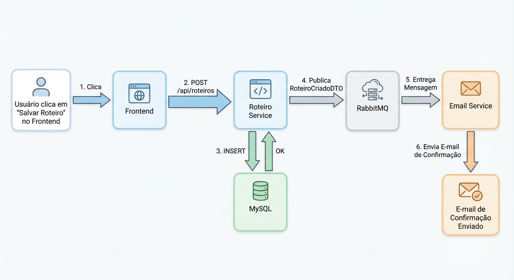

# ✈️ Meu Roteiro 🌍

Este é o projeto final do +Devs2Blu, um sistema fullstack completo para gerenciar a criação e o processamento de roteiros de viagem pessoais. A aplicação utiliza uma arquitetura de microsserviços com Spring Boot, Angular, MySQL e RabbitMQ, totalmente containerizada com Docker.

---

## 📝 Índice

1.  [🗺️ Sobre o Projeto](#1-%EF%B8%8F-sobre-o-projeto)
2.  [✨ Tecnologias Utilizadas](#2--tecnologias-utilizadas)
3.  [🏗️ Arquitetura e Fluxo de Dados](#3-️-arquitetura-e-fluxo-de-dados)
4.  [🚀 Como Rodar o Projeto](#4--como-rodar-o-projeto)
5.  [🖼️ Telas da Aplicação](#5-️-telas-da-aplicação)
6.  [🚨 Instruções Importantes](#6--instruções-importantes)
7.  [🔐 Segurança](#7--segurança)
8.  [📬 Mensageria com RabbitMQ](#8--mensageria-com-rabbitmq)
9.  [⚙️ API Endpoints](#9-️-api-endpoints)
10. [💡 Melhorias Futuras](#10--melhorias-futuras)
11. [👩🏻‍💻 Desenvolvido por](#11-%E2%80%8D-desenvolvido-por)

---

### 1. 🗺️ Sobre o Projeto

| Item                | Detalhe                                                              |
| :------------------ | :------------------------------------------------------------------- |
| **Nome do Projeto** | Meu Roteiro                                                          |
| **Descrição**       | Uma plataforma para usuários criarem, gerenciarem e acompanharem seus planos de viagem, com um sistema de notificações assíncrono. |
| **Público Alvo**    | Viajantes que desejam organizar suas futuras aventuras de forma simples e centralizada. |

---

### 2. ✨ Tecnologias Utilizadas

| Camada           | Tecnologia              | Descrição                                                              |
| :--------------- | :---------------------- | :--------------------------------------------------------------------- |
| **Interface**    | Angular                 | Interface de usuário reativa e moderna para interagir com a API.       |
| **Backend**      | Spring Boot 3 + Java 17 | Microsserviços robustos que expõem uma API REST.                       |
| **Segurança**    | Spring Security         | Autenticação e autorização baseada em sessão para proteger a API.      |
| **Banco de Dados** | MySQL 8.0               | Persistência dos dados de usuários e roteiros.                         |
| **Mensageria**   | RabbitMQ                | Comunicação assíncrona e desacoplada entre os serviços de back-end.    |
| **IA (Sugestões)** | Spring AI + Ollama      | Microsserviço dedicado para gerar sugestões de roteiros com o modelo `phi3:mini`. |
| **Infraestrutura** | Docker & Docker Compose | Containerização e orquestração de todos os serviços da aplicação.      |
| **Build Backend**| Maven                   | Gerenciamento de dependências e build do projeto Java.                 |

---

### 3. 🏗️ Arquitetura e Fluxo de Dados

O sistema é composto por 4 serviços principais, um banco de dados e um broker de mensagens:

-   `roteiro-front`: A aplicação Angular que o usuário acessa no navegador, servida por um **Nginx** que também atua como **Proxy Reverso**.
-   `roteiro-service`: Microsserviço Spring Boot responsável pelo CRUD de roteiros e pela **autenticação/autorização de usuários**.
-   `email-service`: Microsserviço Spring Boot que "ouve" eventos para **enviar e-mails de notificação**.
-   `sugestao-service`: Microsserviço Spring Boot que se conecta ao Ollama para gerar sugestões de roteiros.

---

### 4. 🚀 Como Rodar o Projeto

Com a aplicação totalmente containerizada, o processo para rodar todo o ambiente é muito simples.

#### A. Pré-requisitos

-   Docker e Docker Compose instalados e em execução.
-   Git (para clonar o repositório).
-   Ollama instalado e com o modelo `phi3:mini` baixado (`ollama pull phi3:mini`).

#### B. Passo 1: Configurar as Chaves de API

1.  Na pasta raiz do projeto, crie um arquivo chamado `.env`.
2.  Dentro do arquivo `.env`, adicione a seguinte linha, substituindo o valor de exemplo:
    
    ```
    # Senha para o banco de dados MySQL
    MYSQL_ROOT_PASSWORD=sua_senha_segura
    ```

#### C. Passo 2: Iniciar a Aplicação

1.  Abra um terminal na pasta raiz do projeto.
2.  Execute o seguinte comando para construir as imagens e iniciar todos os contêineres em segundo plano:
    
    ```sh
    docker compose up --build -d
    ```
    *A flag `--build` garante que as imagens sejam (re)construídas com as últimas alterações. Na primeira vez, o processo pode demorar alguns minutos enquanto o Maven e o NPM baixam as dependências.*

#### D. Passo 3: Utilizar a Aplicação

Após a conclusão do comando, aguarde cerca de um minuto para que todos os serviços iniciem.

1.  **Acesse a Aplicação:** Abra seu navegador e vá para `http://localhost`.
2.  **Crie uma Conta e Faça Login:** Use a interface para se registrar e autenticar.
3.  **Gerencie seus Roteiros:** Agora você pode navegar entre a tela de boas-vindas, criar novos roteiros e listar os existentes usando a barra de navegação.

| Serviço             | URL de Acesso                | Portas (Host:Container) | Credenciais (se aplicável)   |
| :------------------ | :--------------------------- | :---------------------- | :---------------------------- |
| **Aplicação (Front-end)** | `http://localhost`           | `80:80`                 | Criadas pelo usuário.         |
| **RabbitMQ (UI)**   | `http://localhost:15672`     | `15672:15672`           | `guest` / `guest`             |
| **Banco de Dados**  | `localhost` (via cliente SQL) | `3307:3306`             | `root` / (definida no `.env`) |

---

### 5. 🖼️ Telas da Aplicação

A seguir, algumas telas que demonstram a interface e a experiência do usuário.

**Tela de Login e Registro**
| Login | Registro |
| :---: | :---: |
|  |  |

**Telas Principais (Após Login)**
| Home (Boas-Vindas) | Lista de Roteiros |
| :---: | :---: |
|  |  |

**Criação de Roteiro**


---

### 6. 🚨 Instruções Importantes

A branch `main` deste repositório contém o histórico completo de desenvolvimento, incluindo diversas tentativas de deploy na nuvem que não foram bem-sucedidas.

Para avaliar a **versão 100% funcional e estável do projeto**, que roda perfeitamente em um ambiente local com Docker Compose, por favor, utilize a branch **`versao-funcional-local`**.

**Instruções:**

1.  **Clone o Repositório e Mude para a Branch Correta:**
    ```sh
    git clone https://github.com/MariaAlineMees/Projeto-Final-Devs2Blu-FullStack.git
    cd Projeto-Final-Devs2Blu-FullStack
    git checkout versao-funcional-local
    ```

2.  **Siga as Instruções de Execução Local:**
    Após mudar para a branch correta, siga as instruções detalhadas na seção **"4. 🚀 Como Rodar o Projeto"** deste `README.md` para configurar as chaves de API e iniciar a aplicação com `docker compose up --build -d`.

---

### 7. 🔐 Segurança

A segurança foi um pilar central do projeto, garantindo que os dados de cada usuário sejam privados e seguros.

-   **Autenticação:** Utiliza o **Spring Security** com `formLogin` baseado em sessão. As senhas dos usuários são criptografadas com **BCrypt** antes de serem salvas no banco de dados.
-   **Autorização:** Após o login, um usuário **só pode ver e gerenciar os seus próprios roteiros**. Toda a lógica no back-end foi alterada para sempre filtrar os dados pelo usuário autenticado na sessão.
-   **Proteção de Rotas:** No front-end, as rotas são protegidas por um **AuthGuard** do Angular, que redireciona qualquer usuário não logado para a página de login.

---

### 8. 📬 Mensageria com RabbitMQ

O projeto implementa dois fluxos de negócio com comunicação assíncrona:

1.  **E-mail de Boas-Vindas:** Ao se registrar, o `roteiro-service` publica uma mensagem na fila `user.registered.queue`, e o `email-service` a consome para enviar um e-mail de boas-vindas.

    

2.  **E-mail de Confirmação de Roteiro:** Ao criar um roteiro, o `roteiro-service` publica uma mensagem na fila `roteiro.criado.queue`, e o `email-service` a consome para enviar um e-mail de confirmação.

    

---

### 9. ⚙️ API Endpoints

A API principal, exposta pelo `roteiro-service`, segue os padrões REST.

| Método | Rota                      | Descrição                                         | Autenticação |
| :----- | :------------------------ | :------------------------------------------------ | :----------- |
| `POST` | `/api/auth/register`      | Registra um novo usuário.                         | Pública      |
| `POST` | `/api/login`              | Autentica um usuário e cria uma sessão.           | Pública      |
| `POST` | `/api/logout`             | Invalida a sessão do usuário.                     | Requerida    |
| `GET`  | `/api/auth/me`            | Obtém os dados do usuário autenticado.            | Requerida    |
| `GET`  | `/api/roteiros`           | Lista todos os roteiros **do usuário autenticado**.   | Requerida    |
| `POST` | `/api/roteiros`           | Cria um novo roteiro para o usuário autenticado.  | Requerida    |
| `GET`  | `/api/roteiros/{id}`      | Busca um roteiro específico por ID.               | Requerida    |
| `PUT`  | `/api/roteiros/{id}`      | Atualiza um roteiro existente.                    | Requerida    |
| `DELETE`| `/api/roteiros/{id}`    | Deleta um roteiro.                                | Requerida    |

---

### 10. 💡 Melhorias Futuras

-   **Integração da IA no Frontend:** O microsserviço `sugestao-service`, que utiliza Spring AI para se comunicar com o Ollama, já está funcional e foi testado via Postman. O próximo passo é criar uma interface no Angular para que o usuário possa enviar um prompt (ex: "um roteiro de 3 dias em Paris para um casal") e receber a sugestão gerada pela IA, integrando-a à criação de roteiros.

-   **Deploy em Nuvem:** O projeto está 100% funcional localmente com Docker Compose. Uma melhoria futura crucial é finalizar o processo de deploy em uma plataforma de nuvem como o Render.com. Os desafios encontrados (documentados em `DEPLOYMENT_LOG.md`) forneceram aprendizados valiosos sobre configuração de rede, variáveis de ambiente e a sintaxe de "Infraestrutura como Código" (`render.yaml`), que serão a base para uma futura tentativa de deploy bem-sucedida.

-   **Testes Unitários e de Integração:** Expandir a cobertura de testes automatizados para garantir a robustez e a manutenibilidade de todos os microsserviços.

-   **Refinamento da Interface:** Melhorar a experiência do usuário (UX) e o design da interface (UI) no front-end para tornar a aplicação mais intuitiva e agradável.

---

### 11. 👩🏻‍💻 Desenvolvido por

| Nome              | GitHub                                            |
| :---------------- | :------------------------------------------------ |
| Maria Aline Mees  | [MariaAlineMees](https://github.com/MariaAlineMees) |
